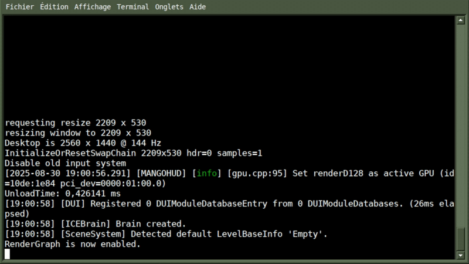

<a href="#"></a>
Long story short, I was making something up that required a Dedicated Server, cool right?<br/>
Well, it was cool until I needed some way of interacting with the systems and game logic of the said Server.

That’s where this utility comes in! Giving me the capability to input commands into my terminal to affect the active behavior of the game.<br/>
I just decided to make it “better” (editor usage), and public.

Quick warning before you read this readme!<br/>
In it, I don’t really dive into every feature and what you can do with this utility. 
If you want a better idea of what you can and cannot do with it, I recommend reading that readme, then actually trying it out
or just checking out the [documentation](#doc).
<hr>

<a href="#"></a>
<!--ts-->
* [Features Overview](#feature-overview)
  * [Terminal/CMD Usage (Builds)](#overview-terminal-usage)
  * [Pass-In Arguments](#overview-arguments)
  * [In-Editor Console](#overview-editor-console)
  * [Dump to MARKDOWN](#overview-dump-to-markdown)
* [Installation and Usage](#installation-usage)
* [Documentation](#doc)
* [Code Standards/Norm](#code-standards)
* [Tested on](#tested-on)
<!--te-->
<hr>

<a href="#"></a>
<a href="#"></a><br/>
The utility was mainly made to be used on builds inside a Terminal/CMD on both Windows and Linux.
You simply need to launch your game through a Terminal and start to write commands!



<a href="#"></a><br/>
When you start an application, you can pass in launch arguments. Well, that's the same thing when you call a command.<br/>
If your method supports args, you can use them in the terminal/editor to have a different behavior.

Here’s an example on how to do that very easily:
```
#if RDNTLG_CCM || UNITY_EDITOR

    [ConsoleCommand("hello_what", "name", null), Preserve]
    private static void HandleCommand(ArgumentsParser _args) {
        if (_args["name"] is not null or "") {
            Debug.Log($"Hello {_args["name"]}!");
        } else {
            Debug.Log("The argument 'name' is missing!");
        }
    }

#endif
```

The command written is `hello_what -name "world"` and the output should be `Hello world!`.<br/>
You can see a demo of that specific command in the section below...

<a href="#"></a><br/>
When I first made the utility, it was only aimed to be working on Dedicated Servers.<br>
But after using it for quite a while, it became very painful not being able to use it inside the editor, 
forced to recompile/rebuild the application each time a change was made.

That’s where this (quite experimental) Editor Window comes in.<br>
The whole idea is simply to be able to execute commands on the fly 
while being in play mode in the editor. Nothing more, nothing less.


Be aware that I'm very bad when it comes to making custom windows, 
and that part of the utility WON'T EVER replace the default Console offered by Unity.

This part of the tool is available under the `Tools > RDNTLG` tab in the editor.

<a href="#"></a><br/>
So now, you've written over 100 commands using this utility (impressive tbh). You might be wondering how you 
can list all commands available, right?
Although the utility supports the command `help`, it's not quite practical to have every command displayed like that. 
Look no further than “Dump to markdown”!

In the editor, under the `Tools > RDNTLG` you can dump all usable commands to a simple Markdown file. 
This part of the tool itself is very simple and makes the listing of all available commands much simpler overall.

You can see an example of the output in [CommandsDump.md](CommandsDump.md).
<hr>

<a href="#"></a>
Just clone this repo in your project.

If you plan to use this system outside the editor (<i>Standalone builds</i>), you must
define the `RDNTLG_CCM` preprocessor definition. You can do it in either your "Build Profile"
(require Unity 6) or in the "Player Settings".

By default, the system is available to use in the editor without any action.


Here's an example on how to create a new method that can be called by a command:
```
#if RDNTLG_CCM || UNITY_EDITOR

    [ConsoleCommand("COMMAND_NAME", "SUPPORTED_ARGS", "EXAMPLE"), Preserve]
    private static void HandleCommand(ArgumentsParser _args) {
        Debug.Log("Hello World!");
    }

#endif
```
The system will only look for a static method with a signature as written, the signatures can be checked 
in the editor under the `Tools > RDNTLG` tab.
<hr>

<a href="#"></a>
When you clone a version of this repository, you take with yourself a copy of the
generated documentation of the source code (Documentation is generated with [Natural Docs](https://naturaldocs.org/)).

This documentation is located in `Docs/Generated/index.html`. Providing anyone
a lighter documentation of the source code at any time without obligation to open the
engine, IDE and/or the source code itself. But sadly, you'll need to get a local copy of this repo
to interact with it...

A stated previously, the documentation of stock commands is available in [CommandsDump.md](CommandsDump.md).
<hr>

<a href="#"></a>
Class : ``` CamelCase ```<br>
Attributes : ``` camelCase ```<br>
Variables : ``` _camelCase ```<br>
Methods : ``` CamelCase() ```<br>
Enums : ``` ENameOfEnum ```<br>
Enum Values : ``` VALUE ```<br>
<hr>

<a href="#"></a>
The utility itself was written for Unity 6 (6000.2.0F1) (Windows/Linux), but I don’t see any reason why it wouldn’t 
work on newer/older versions of the engine.<br/>
If you spot any issues, please let me know.
<hr>